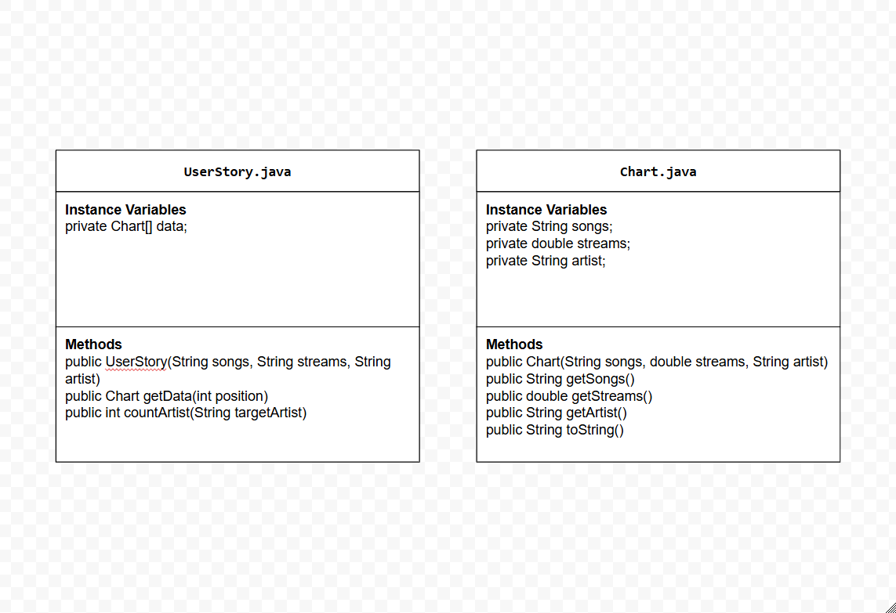

# Unit 3 - Data for Social Good Project 

## Introduction 

Software engineers develop programs to work with data and provide information to a user. Each user has different needs based on the information they are looking for from data. Your goal is to create a data analysis program for your user that stores and analyzes data to provide the information they need. 

## Requirements 

Use your knowledge of object-oriented programming, one-dimensional (1D) arrays, and algorithms to create your data analysis program: 
- **Write a class** – Write a class to represent your user or business and store and analyze their data with no-argument and parameterized constructors. 
- **Create at least two 1D arrays** – Create at least two 1D arrays to store the data that your user needs information about. 
- **Write a method** – Write a method that finds or manipulates the elements in a 1D array to provide the information your user needs. 
- **Implement a toString() method** – Write a toString() method that returns general information about the data (for example, number of values in the dataset). 
- **Document your code** – Use comments to explain the purpose of the methods and code segments and note any preconditions and postconditions. 

## User Story 

Include your User Story you analyzed for your project here. Your User Story should have the following format: 

> As an Spotify user,   
> I want to analyze the data of the top songs of 2023,   
> so that I can gain insight about top songs in 2023 and information about a desired artist. I can share playlists and suggest song ideas for content creators. 

## Dataset 

Include a hyperlink to the source of your dataset used for this project. Additionally, provide a short description of each column used from the dataset, and the data type. 

Dataset: https://www.kaggle.com/code/nelgiriyewithana/an-introduction-to-top-spotify-songs-2023/input 
Updated & Altered Dataset: https://docs.google.com/spreadsheets/d/1vJi5GZUFIk3WFrTTEAVeOD0-daI5-jYAVno4CDm4Y2Y/edit?usp=sharing
- **Songs** (String) - name of the song 
- **Streams** (double) - number of streams for a given song
- **Artist** (String) - name of the artist

## UML Diagram 

Put and image of your UML Diagram here. Upload the image of your UML Diagram to your repository, then use the Markdown syntax to insert your image here. Make sure your image file name is one work, otherwise it might not properly get display on this README. 

 

## Description 

Our project is a data analysis program designed to help a Spotify user gain insights into the top songs of 2023. The program uses object-oriented programming principles, which focuses on encapsulating data and behavior in the Java classes. Our program has three txt files that are the songs, streams, and artist and the UserStory class processes this data by using a 1D array called data, which holds multiple Chart objects. Each Chart object encapsulates information about a single song, including its title, artist name, and the number of streams. We also have a scanner object, allowing for user input. The user types an artist and info about that artist is printed out. 